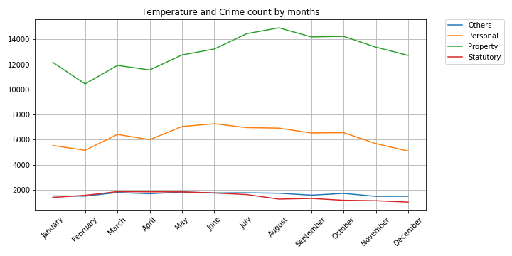

# Chicago_Crime_Weather
We gathered crime and weather data for Chicago in 2016 to see if there is a correlation between temperature and types of crimes. 

**Crime Categories:**

*Personal*: Battery, assault, offense involving children, sexual assault, sex offense, homicide, kidnapping, intimidation, stalking, obscenity, public indecency, human trafficking, domestic violence

*Property*: Theft, criminal damage, burglary, motor vehicle theft, deceptive practice, robbery, criminal trespass, arson

*Statutory*: Narcotics, weapons violation, interference with public officer, liquor law violation, other narcotic violation

*Other*: Prostitution, public peace violation, gambling, concealed carry license violation, non-criminal, ritualism

 

Since the data was available we also charted crime at different times and months. 

 

 

### Copyright

Four Squared: Komal, Jaime, Jane, and Gerard © 2019. All Rights Reserved.
